<!-- Animated Typing Effect Header -->
<h1 align="center">
  
</h1>

<h3 align="center">
  
</h3>

<!-- Animated Data Analyst GIF -->
<p align="center">

</p>

<!-- Social Badges with Animations -->
<p align="center">
  <a href="https://www.linkedin.com/in/owaisali-econ" target="_blank">
    
  </a>
  <a href="mailto:owais.ali.shah.econ@gmail.com">
    
  </a>
  <a href="https://github.com/econ-owais">
    
  </a>
  
</p>

<!-- Animated Separator -->


---

## 🎯 **About Me** 


```yaml
name: Owais Ali Shah
role: Data Analyst & Economist
location: Pakistan 🇵🇰
education: Economics Graduate
passion: Transforming Complex Data into Actionable Insights

current_focus:
  - Building interactive public sector dashboards
  - Economic policy research & visualization
  - Bilingual data storytelling (EN/UR)
  - Shiny app development & optimization

expertise:
  - Data Visualization & Dashboard Design
  - Economic Modeling & Forecasting
  - Statistical Analysis & Interpretation
  - Policy Impact Assessment
```

### **🌟 What Drives Me**
I'm an economics graduate passionate about **turning numbers into narratives** that drive real-world impact. From flood recovery analytics to SDG tracking dashboards, I specialize in making complex economic data accessible, actionable, and visually compelling for policymakers, planners, and the public.

---

## 🧠 **Core Expertise**

<table>
<tr>
<td width="50%">

### 📊 **Data Visualization**
- Interactive R Shiny Dashboards
- Tableau & Power BI Analytics
- Infographic Design
- Geospatial Mapping
- Real-time Data Storytelling

</td>
<td width="50%">

### 📈 **Economic Analysis**
- Econometric Modeling
- Time Series Forecasting
- Policy Impact Evaluation
- SDG Progress Tracking
- Macro & Micro Analysis

</td>
</tr>
<tr>
<td width="50%">

### 💻 **Technical Skills**
- Data Pipeline Engineering
- Web Scraping & Automation
- Database Management (SQL)
- Version Control (Git/GitHub)
- Reproducible Research

</td>
<td width="50%">

### 🌍 **Public Impact**
- Bilingual Communication (EN/UR)
- Stakeholder Engagement
- Educational Material Design
- Community Outreach
- Policy Documentation

</td>
</tr>
</table>

---

## 🛠️ **Technology Stack**

<p align="center">

### **Programming & Analysis**

<br><br>

### **Data & Databases**


<br><br>

### **Visualization Tools**


<br><br>

### **Development & Deployment**


</p>

---

## 🚀 **Featured Projects Portfolio**

<div align="center">

### 🌍 **Public Sector Analytics | Real-World Impact | Data-Driven Solutions**

</div>

<!-- Project Grid -->
<table>
<tr>
<td width="50%" valign="top">

### 🎯 **Pakistan SDGs Indicators Dashboard**
 **Sustainable Development Goals Tracker**

**📋 Description:**  
Comprehensive national progress monitoring system tracking 17 SDGs with interactive filters, time-series analysis, and provincial comparisons.

**🔧 Tech Stack:**  
`R Shiny` `ggplot2` `plotly` `dplyr` `shinydashboard`

**✨ Features:**
- 📊 100+ Interactive Indicators
- 🗺️ Provincial & District Level Data
- 📈 Trend Analysis & Forecasting
- 🎨 Custom Data Visualizations

<p align="center">
  <a href="https://econ-owais.github.io/Pakistan_SDGS-indicator-s-Dashboard/">
    
  </a>
  <a href="https://econ-owaisali.shinyapps.io/Pakistan-SDGs-Indicators-Dashboard/">
    
  </a>
</p>

</td>
<td width="50%" valign="top">

### 🌊 **KPK Flood Impact Infographic**
 **Disaster Analytics Platform**

**📋 Description:**  
Geospatial visualization of 2022 flood impact across Khyber Pakhtunkhwa, mapping affected districts, displacement data, and recovery needs.

**🔧 Tech Stack:**  
`R Shiny` `leaflet` `sf` `highcharter` `flexdashboard`

**✨ Features:**
- 🗺️ Interactive Flood Mapping
- 📊 Damage Assessment Metrics
- 👥 Population Impact Analysis
- 🏘️ District-wise Breakdown

<p align="center">
  <a href="https://econ-owais.github.io/KPK-Flood-Impact-Infographic-/">
    
  </a>
  <a href="https://econ-owaisali.shinyapps.io/kpk_flood_dashboard/">
    
  </a>
</p>

</td>
</tr>

<tr>
<td width="50%" valign="top">

### 🥗 **Healthy Diet Affordability Dashboard**
 **Food Security Analytics**

**📋 Description:**  
FAO-based analysis tracking nutritious diet affordability across Pakistan, examining food price trends and accessibility gaps.

**🔧 Tech Stack:**  
`R Shiny` `DT` `echarts4r` `tidyverse` `shinythemes`

**✨ Features:**
- 💰 Cost of Healthy Diets
- 📉 Affordability Trends
- 🌾 Nutrient Availability
- 🇵🇰 Regional Comparisons

<p align="center">
  <a href="https://econ-owais.github.io/Healthy-Diet-Affordability-Dashboard/">
    
  </a>
  <a href="https://econ-owaisali.shinyapps.io/Healthy-Diet-Dashboard/">
    
  </a>
</p>

</td>
<td width="50%" valign="top">

### 🇵🇰 **Pakistan Development Indicators**
 **Socio-Economic Dashboard**

**📋 Description:**  
Multi-dimensional development tracker covering education, health, infrastructure, and economic indicators with branded design.

**🔧 Tech Stack:**  
`R Shiny` `shinyWidgets` `plotly` `DT` `bslib`

**✨ Features:**
- 📚 Education Metrics
- 🏥 Health Indicators
- 🏗️ Infrastructure Data
- 💼 Economic Statistics

<p align="center">
  <a href="https://econ-owais.github.io/pakistan-indicators-dashboard./">
    
  </a>
  <a href="https://econ-owaisali.shinyapps.io/irrigation_project/">
    
  </a>
</p>

</td>
</tr>

<tr>
<td width="50%" valign="top">

### 📉 **Pakistan Macro Indicators Dashboard**
 **Macroeconomic Monitor**

**📋 Description:**  
Comprehensive macroeconomic analytics platform tracking inflation, GDP growth, trade balance, fiscal indicators, and monetary policy.

**🔧 Tech Stack:**  
`R Shiny` `forecast` `quantmod` `plotly` `shinydashboard`

**✨ Features:**
- 💹 GDP Growth Analysis
- 📊 Inflation Tracking
- 🌐 Trade Balance Metrics
- 💰 Fiscal Indicators

<p align="center">
  <a href="https://econ-owais.github.io/Pakistan-Macro-Indicators-Dashboard/">
    
  </a>
  <a href="https://econ-owaisali.shinyapps.io/Pakistan-macro-indicator-Dashboard/">
    
  </a>
</p>

</td>
<td width="50%" valign="top">

### 🚜 **Irrigation Dashboard for Pakistan**
 **Water Resource Analytics**

**📋 Description:**  
Agricultural water management system analyzing irrigation infrastructure, water availability, and crop water requirements for policy reform.

**🔧 Tech Stack:**  
`R Shiny` `leaflet` `ggplot2` `dplyr` `shinyBS`

**✨ Features:**
- 💧 Water Availability Analysis
- 🌾 Crop Water Requirements
- 🏞️ Basin-wise Data
- 📈 Efficiency Metrics

<p align="center">
  <a href="https://econ-owaisali.shinyapps.io/irrigation_project/">
    
  </a>
</p>

</td>
</tr>
</table>

---

## 📊 **GitHub Analytics**

<p align="center">
  
  
</p>

<p align="center">
  
</p>

<p align="center">
  
</p>

### **🏆 GitHub Trophies**
<p align="center">
  
</p>

---

## 💼 **Professional Workflow**

```mermaid
graph LR
    A[📊 Data Collection] --> B[🔍 Analysis & Modeling]
    B --> C[📈 Visualization]
    C --> D[🎨 Dashboard Design]
    D --> E[🚀 Deployment]
    E --> F[📣 Stakeholder Communication]
    F --> G[🔄 Iteration & Refinement]
```



### **🎯 My Approach**

<table>
<tr>
<td align="center" width="25%">
<br>
<b>Mission-Driven</b><br>
Every project serves a public or educational purpose
</td>
<td align="center" width="25%">
<br>
<b>Detail-Oriented</b><br>
Pixel-perfect fonts, layouts, and interactions
</td>
<td align="center" width="25%">
<br>
<b>Bilingual-First</b><br>
English/Urdu for maximum accessibility
</td>
<td align="center" width="25%">
<br>
<b>Iterative</b><br>
Continuous refinement based on feedback
</td>
</tr>
</table>

---

## 🌟 **Specializations**

<details>
<summary><b>📊 Data Visualization & Dashboarding</b></summary>
<br>

- **Interactive Dashboards:** R Shiny, Tableau, Power BI
- **Statistical Graphics:** ggplot2, plotly, highcharter
- **Geospatial Mapping:** leaflet, sf, tmap
- **Infographic Design:** Canva, Adobe Suite integration
- **Real-time Analytics:** Dynamic data pipelines

</details>

<details>
<summary><b>📈 Economic Research & Analysis</b></summary>
<br>

- **Econometric Modeling:** Time series, panel data, regression analysis
- **Policy Impact Evaluation:** Difference-in-differences, RDD
- **Forecasting:** ARIMA, exponential smoothing, ML methods
- **SDG Analytics:** Goal tracking, indicator development
- **Macroeconomic Analysis:** Growth, inflation, trade dynamics

</details>

<details>
<summary><b>💻 Technical Development</b></summary>
<br>

- **Web Development:** HTML, CSS, JavaScript for interactive reports
- **Data Engineering:** SQL, data cleaning, ETL processes
- **Automation:** R scripts, Python scripting for workflows
- **Version Control:** Git, GitHub for reproducible research
- **Deployment:** ShinyApps.io, GitHub Pages, server management

</details>

<details>
<summary><b>🌍 Public Sector Communication</b></summary>
<br>

- **Bilingual Content:** English/Urdu translations and localization
- **Stakeholder Engagement:** Presenting to policymakers and NGOs
- **Educational Materials:** Posters, brochures, training docs
- **Data Storytelling:** Narrative-driven visualizations
- **Accessibility:** Designing for diverse audiences

</details>

---

<!DOCTYPE html>
<html lang="en">
<head>
  <meta charset="UTF-8">
  <title>🎓 Featured Achievements</title>
</head>
<body>

<h2>🎓 <strong>Featured Achievements</strong></h2>

<table>
  <tr>
    <td align="center" width="33%">
      <br>
      <strong>6+ Dashboards</strong><br>
      Public sector analytics platforms
    </td>
    <td align="center" width="33%">
      <br>
      <strong>1000+ Data Points</strong><br>
      Analyzed and visualized
    </td>
    <td align="center" width="33%">
      <br>
      <strong>Bilingual Impact</strong><br>
      EN/UR accessible tools
    </td>
  </tr>
</table>

<hr>

</body>
</html>

## 🎉 **Fun Facts About Me**


```javascript
const owais = {
  coffee: "☕ Fuels my coding sessions",
  debugging: "🔍 I hunt bugs like a detective",
  fonts: "✒️ Yes, fonts matter—especially in certificates!",
  dashboards: "📊 Built dashboards for irrigation, electricity, SDGs",
  belief: "💡 Data should tell stories, not just numbers",
  motto: "🚀 From raw data to real impact",
  quirk: "🎨 I color-code my datasets",
  fun: "🐱 Even analysts need cat GIFs"
};
```

---

## 📬 **Let's Connect!**

<p align="center">
  <a href="https://www.linkedin.com/in/owaisali-econ" target="_blank">
    
  </a>
  <a href="mailto:owais.ali.shah.econ@gmail.com">
    
  </a>
  <a href="https://github.com/econ-owais">
    
  </a>
</p>

<p align="center">
  
</p>

---

<div align="center">

### 💡 **"The goal is to turn data into information, and information into insight."** 
*— Carly Fiorina*


### 🧠 **Thanks for visiting! Let's connect and build tools that make data speak.**


</div>

<!-- Snake Animation -->
<picture>
  <source media="(prefers-color-scheme: dark)" srcset="https://raw.githubusercontent.com/econ-owais/econ-owais/output/github-contribution-grid-snake-dark.svg">
  <source media="(prefers-color-scheme: light)" srcset="https://raw.githubusercontent.com/econ-owais/econ-owais/output/github-contribution-grid-snake.svg">
  
</picture>

---

<p align="center">
  
  
  
</p>
